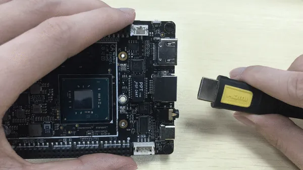
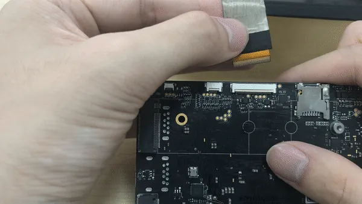

# Display and Touch Connections

This document will go over the different ways you can display the screen from your Innuo. It will cover what you will need and the installation steps.

!!! warning

    - When touching the Innuo board, make sure to ground yourself before touching the board. Failure to ground yourself may cause static discharge into board components, which can damage your Innuo!    
    - The touch screen is made of glass, which is corrosion-resistant, but the material itself is easy to crack. Please be careful not to press it to the edge during installation!

## Overview

### 4 Ways to Extend Displays on the Innuo Alpha

1. HDMI - Standard desktop usage
2. Type C to HDMI / DP converter - Standard desktop usage
3. [Connect to Macbook Pro or any other development PC via Streaming Cable - **Designed for Developers**](../streaming_cable/get_started.md)
4. eDP displays - **Designed for embedded applications**

### 4K Capability
Max resolution from different physical display output channels on Alpha: 
1. HDMI	4096x2304 @24 Hz (1.4a)
2. DP	  4096x2304 @60 Hz (1.2)
3. eDP	4096x2304 @60 Hz (1.4)

## HDMI

### What You Will Need

* HDMI cable
* TV or monitor with HDMI port

### Installation Steps

1. Connect an HDMI cable to the Innuo's HDMI port.
2. Connect the other end of the HDMI cable to a TV or monitor.
    

## DP / DVI / VGA

### What You Will Need

!!! note
    In order to power on the Innuo Alpha/Delta with the USB Type C port while using a USB Type C adapter, the adapter must have Power Delivery passing current through.

* USB Type C to DVI / VGA / DP adapter or hub
* Display cable (Depending on adapter type)

### Installation Steps

1. Connect the USB Type C adapter to the Innuo Alpha/Delta's USB Type C port.
2. Connect the display cable (DVI, VGA, DP) to the USB Type C adapter.
3. Connect the other end of the display cable to the TV or monitor.

## Embedded DisplayPort (eDP)

!!! note 
    The Innuo may not have driver support for 3rd party eDP displays. In order to use a 3rd party display, it may require the installation of other development drivers.

### What You Will Need

* Innuo Alpha/Delta eDP Display

### Installation Steps

!!! warning
    Make sure the Innuo is disconnected from its power source before connecting the display. Make sure the cable is installed correctly before turning the power on. Failure to follow these instructions below may cause a short circuit and damage the Innuo or display.

1. Make sure the Innuo is powered off and the power supply cable is disconnected.
2. Open the eDP latch on the Innuo board.
3. Align the eDP cable with the Innuo cable connector. Make sure the copper cable connection pads face the Innuo connection pads.
4. Connect the eDP cable. 
5. Press down on the latch to secure the cable.

### Additional eDP Displays from Community

While the Innuo Alpha/Delta eDP display is officially supported, here are some other displays community members have gotten working.

* [17.3" Display--no bios update needed](https://www.Innuo.com/topic-f23t17107.html?start=11)

## Touch Panel

### What You Will Need

* Official eDP display for Innuo Alpha and Delta.

!!! warning
    The MIPI display design for the Innuo 1st generation is not compatible with the eDP display connectors designed for the Alpha and Delta. This compatibility issue is caused by the different CPU architectures and positioning of circuit elements.

### Installation Steps

!!! warning
    Make sure the Innuo is disconnected from its power source before connecting the touch screen. Make sure the cable is installed correctly before turning the power on. Failure to follow these instructions below may cause a short circuit and damage the Innuo or display.

1. Make sure the Innuo is powered off and the power supply cable is disconnected.
2. Open the touch panel latch on the Innuo board.
3. Align the touch panel cable with the Innuo touch panel connector. Make sure the copper cable connection pads face the Innuo connection pads.
4. Connect the touch panel cable.
5. Press down on the latch to secure the cable.

## Streaming Cable

Please check the docs for a streaming cable here: [Getting Started - Streaming Cable](../streaming_cable/get_started.md)

## Related Links 

* [Getting Started with Alpha/Delta](get_started.md)
* [Powering Innuo Alpha/Delta](powering.md)
