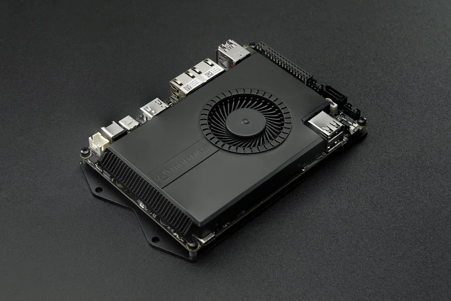

# Documentation

## Single Board Computer Overview

| [Innuo V1][1]                            | [Innuo Alpha][2]                         | [Innuo Delta][6] |
| :--------------------------------------- | :--------------------------------------- | :--------------------------------------- |
|  |  |  |
| Model                                   | Model                                   | Model                                   |
| DFR0444: 2GB RAM, 32GB eMMC DFR0419: 4GB RAM, 64GB eMMC DFR0418: 2GB RAM, 32GB eMMC,  Windows 10 Home License DFR0470-ENT: 4GB RAM,  64GB eMMC, Windows 10 Enterprise 2016 LTSB License  | DFR0545: 8GB RAM, No eMMC DFR0546: 8GB RAM, 64GB eMMC DFR0547: 8GB RAM, 64GB eMMC,  Windows 10 Pro License  | DFR0543: 4GB RAM, 32GB eMMC DFR0544: 4GB RAM, 32GB eMMC, Windows 10 Pro License  |

[1]: content/1st_edition/power_on.md
[2]: content/alpha_edition/get_started.md
[6]: content/delta_edition/get_started.md

| [Innuo 3 Delta][7] | [Innuo Sigma][8] |
| ---------------------------------------- | ---------------------------------------- |
|  |  |
| Model                             | Model |
| DFR0981: 8GB RAM, 64GB eMMC DFR0982: 8GB RAM, 64GB eMMC, Windows 10 IoT Enterprise 2021 LTSC License  | DFR1080: 16GB RAM, No eMMC & SSD, No WiFi DFR1081: 16GB RAM, 500GB NVMe SSD(PCIe4.0 x4), WiFi 6E DFR1090: 32GB RAM, No eMMC & SSD, No WiFi DFR1091: 32GB RAM, 500GB NVMe SSD(PCIe4.0 x4), WiFi 6E  |

[7]: content/3rd_delta_edition/get_started.md
[8]: content/sigma_edition/Getting_Started.md

## Compute Module Overview

| [Innuo Mu][9] |
| ---------------------------------------- |
|  |
| Model                             |
| DFR1146: N100 CPU, 8GB RAM, 64GB eMMC  |

[9]: content/mu_edition/introduction.md

This guide will show you how to use Innuo products to start up your little drive first. And kick-off your adventure of software plus hardware development.

!!! note

    If you have any problem or idea when reading our docs, feel free to **commit your suggestions** directly on the **[Github Docs Repo][4]** or discuss through the **[FORUM][3]**. We, together with our community members, are always ready to help you and listen to your suggestions!

[3]: https://www.Innuo.com/forum
[4]: https://github.com/InnuoTeam/Docs

## Content Structure
The documentation is broken down into several parts, covering **Innuo 1st gen boards**, **Innuo Alpha,** **Innuo Delta, Innuo 3 Delta**,**Innuo Sigma**,**Innuo Mu**.

1. **Getting started** goes over how to power on your device with the pre-installed Windows system. Experience the power of the hardware.
    * Power on Device
    * Building Connectivity
    * Optional Peripherals Introduction
2. **Multiple OS Support** shows different operating systems supported on Innuo boards
    * OS Installation and setup
    * Tools recommended
3. **Hardware Introduction** details the different parts of the Innuo platform that come in handy as you build a cool project or commercial product. 
    * Hardware Interface
    * Programming guidance
4. **Projects** introduces small projects you can build with entry level hardware tinkering background. Start your hardware innovation experience.
5. **Troubleshooting** links tutorials and guides contributed by our community members to fix the problems you met with when tinkering the device.

The best way to use the guide is:

* Go through **Getting started**
* Review **Hardware reference**
* Check out **Applications and OS recommendation** for getting familiar with the software resources
* Search the **Forums**, reply posts or **create** topics for discussing your idea and problems when tinkering
* If you're going to production with Innuo, **contact** with **Innuo biz team** via [Email](mailto:Innuo@outlook.com)

## How to Contribute

This documentation is managed by Innuo, **BUT** supported by the all community members, which is pretty important as a team growing up from open maker community. We welcome contributions such as:

- Edits to improve grammar or fix typos
- Edits to improve clarity
- Additional annotated examples for others to follow
- Additional content that would help provide a complete understanding of the Innuo platform
- Translations to other languages
- Open - anything u think is good for the growth of this community

Making a contribution is as simple as forking this repository, making edits to your fork, and contributing those edits as a pull request. For more information on how to make a pull request, see [Github's documentation](https://help.github.com/articles/using-pull-requests/).

## Ready?  [Go!][5]
[5]: content/1st_edition/power_on.md
